FrihGAA

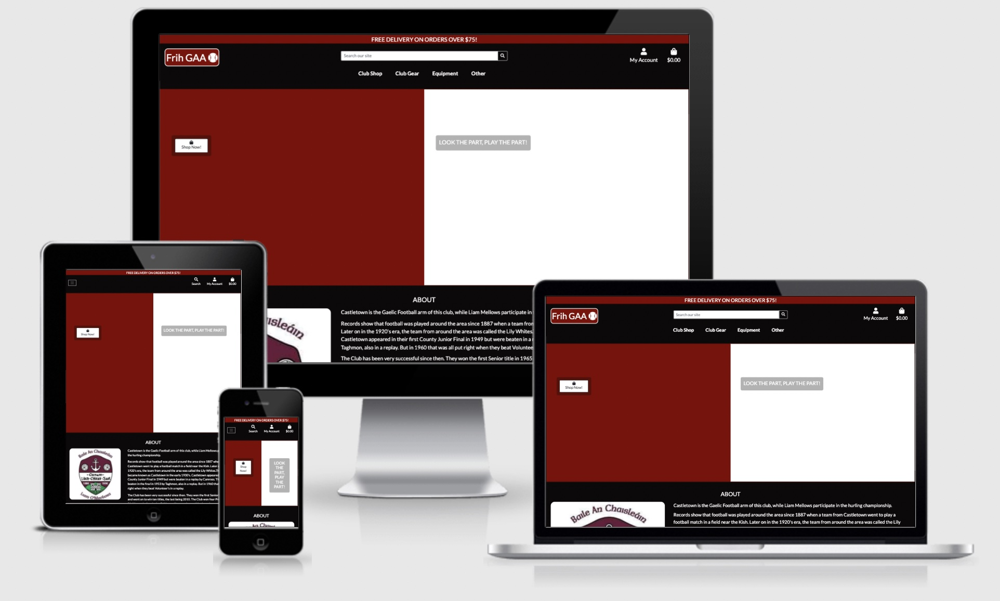

FrihGAA is my final project for the Code Institute's Professional Diploma. It is a Web Application for a fictional GAA club that satisfies the requirements of this assessment. The brief provided for this project in the Assessment handbook was to 

*"build a full-stack site based around business logic used to control a centrally-owned dataset. You will set up an authentication mechanism and provide paid access to the site's data and/or other activities based on the dataset, such as the purchase of a product/service."*

- [User Experience (UX)](#user-experience--ux-)
  * [Site Owner Goals](#site-owner-goals)
  * [User Stories](#user-stories)
  * [User Requirements](#user-requirements)
  * [User Expectations](#user-expectations)
- [Design Choices](#design-choices)
  * [Fonts](#fonts)
  * [Colours](#colours)
  * [Icons](#icons)
  * [Structure](#structure)
    + [Base](#base)
    + [Home / Landing](#home---landing)
    + [Products](#products)
    + [Product Details](#product-details)
    + [Basket](#basket)
    + [Checkout](#checkout)
    + [Profile](#profile)
    + [Contact](#contact)
    + [FAQ](#faq)
  * [Wireframes](#wireframes)
  * [Data Schema](#data-schema)
    + [Profiles App](#profiles-app)
  * [Products App](#products-app)
- [Features](#features)
  * [Features Implemented](#features-implemented)
  * [Features Yet To Implement](#features-yet-to-implement)
- [Technologies Used](#technologies-used)
  * [Languages](#languages)
  * [Frameworks & Libraries](#frameworks---libraries)
  * [Tools](#tools)
- [Testing & Bugs](#testing---bugs)
- [Deployment](#deployment)
  * [Deploying Locally](#deploying-locally)
    + [Cloning](#cloning)
  * [Heroku](#heroku)
- [Disclaimer](#disclaimer)
- [Credits](#credits)
  * [Images and Content](#images-and-content)
  * [Code](#code)
- [Final Comments](#final-comments)

<small><i><a href='http://ecotrust-canada.github.io/markdown-toc/'>Table of contents generated with markdown-toc</a></i></small>


## User Experience (UX)

### Site Owner Goals
**As the site owner, I would like:**
* Access the admin section of the site
* To Create, Read, Update and Delete items in the database from a centralised location through the admin app
* Club members to be able to easily contact the club via the site's contact form
* To sell club merchandise through the site
* Give the club a professional look and feel to attract new members

### User Stories
**As a user, I want to:**  
* the site navigation to be easy and very intuitive
* be able to register a profile on the site with all my details
* be able to log in and out easily
* be able to recover my password if I no longer remember it
* receive confirmation emails throughout the registration process
* be able to view my profile details and past orders
* be able to view all the products available to purchase
* be able to sort products by Category/Price/Name
* be able to see a more detailed page about a particular product
* be able to easily add products to my basket
* be able to view the items in my basket from anywhere in the site
* be able to adjust the quantity of products in the basket, from the basket
* be able to checkout from the basket page
* be able to easily enter my payment details and make payments
* be able to hava my delivery and payment details autofill in checkout once I have a profile
* recieve an order confirmation email directly after checkout
* be able to search the site for products or membership types using keywords in the search bar
* be able to contact the site owners easily through a contact form on the site
* receive an acknowledgement email to let me know my contact form has been submitted
* be able to view a list of FAQs on the site to find out more information about the club

## Design Choices
### Fonts
For the fonts on the site, I used [Google Fonts](https://fonts.google.com/?standard-styles=). This is a really fantatic service of [Google](https://google.com) which is great for getting nearly any kind of font you want. The fonts I chose for my page are *Lato* & *Roboto* with *sans-serif* as a backup font in the event that [Google Fonts](https://fonts.google.com/?standard-styles=) does not work. The reason I decided to use *Lato* & *Roboto* is that I found them to be quite sleek fonts which would almost represent a pair of football boots. 

### Colours
I used [Coolors](https://coolors.co/) to assist in generating a colour scheme for the site. This is a great site as it gives you the codes of the colours you want in any form you want ie. Hex codes for my site. 
The colour scheme I have chosen for the site is Black(#0B0909), White (#FFFFFF) and Maroon (#800000). The reasons for this choice is that they are the same colours as my own GAA club.

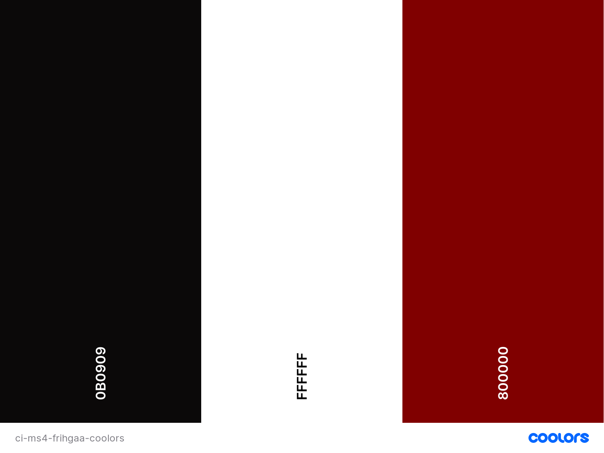

### Icons 
I have gone to [Font Awesome](https://fontawesome.com/) for the icons that I have used in the site. The icons, I feel just add a little bit extra to the site in terms of style and make it a bit more visually appealing which ultimately provides a better User Experience.

### Structure

#### Base
The base template is used to give the overall site the same look and feel. It holds elements that are displayed across the entire site i.e. navbar, footer, social media links the club logo and the site brand. Also in the base is the banner that stretches across the screen and lets the user know that they could avail of free delivery if they spend a set amount of money on products.

#### Home / Landing
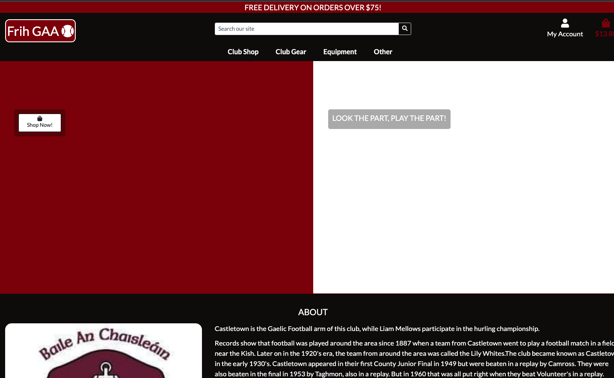
The landing page aims to be attractive to the user and let them know exactly what the site is at a glance. The user shouldn't have to look very far to be gently nudged to go to the products page where they can buy club merchandise.

#### Products

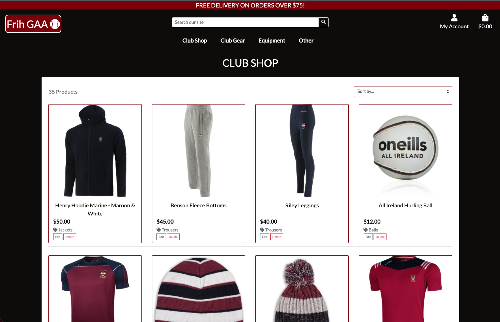
The products will be displayed on this page. There will be options for the user to navigate to specific categories of products in the navbar or even sort by price or category. There is some basic information displayed on each product i.e. name, price, category,and an image. The products are displayed in a grid view which changes in structure depending on the screen size. More detailed product information can be viewed when the user clicks into the product. As this page will require the user to scroll down a lot to see different products, there is also a back to top button placed in the bottom right-hand corner of the screen once the user begins scrolling.

If the user is a site owner, they will be able to see edit and delete buttons attached to each product. If the user clicks on the edit button, they will be taken to the edit product form where they make amendments to aspects of the product.

If the user is a site owner and they want to be able to add a product, there is a link in the account link in the navbar to the product management page. They will be able to add products here. This form is very similar to the edit product form.

#### Product Details

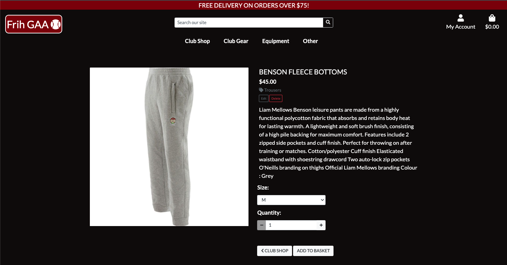

Once the user clicks into a specific product that they like, they will be taken to a the product's detail page where they can read a little bit about that product, what category it belongs to, add a chosen quantity or size (if relevant) to the basket, and view a larger version of the product image.

#### Basket

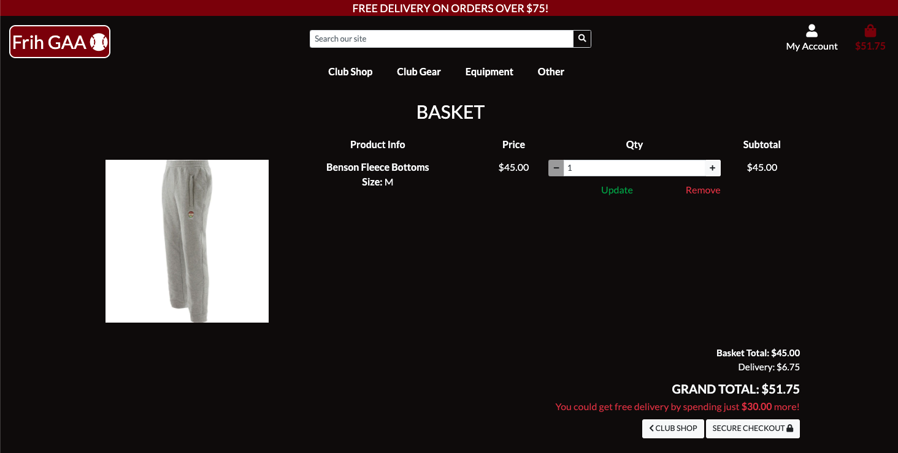

The basket can be accessed from anywhere in the site from the navbar. The basket total will also be displayed in the navbar underneath the basket icon. Once a user clicks the 'add to basket' `button`, a `toast` will be displayed on the page giving the user an oversite of the basket and what the total is. There is also a 'proceed to checkout' `button` on the toast which will allow the user to easily access the basket and subsequently, the checkout page. On the basket page, each item that the user has added will be displayed on it's own line which will give the user various details about that item i.e. what quantity and size has been selected and a subtotal price. There is also a total cost and if the user has not spent enough to gain free delivery, how much they need to avail of this. Form here the user can edit their basket easily usin the buttons on each lineitem. Once, the user is satisfied with their basket, they can proceed to checkout.     

#### Checkout
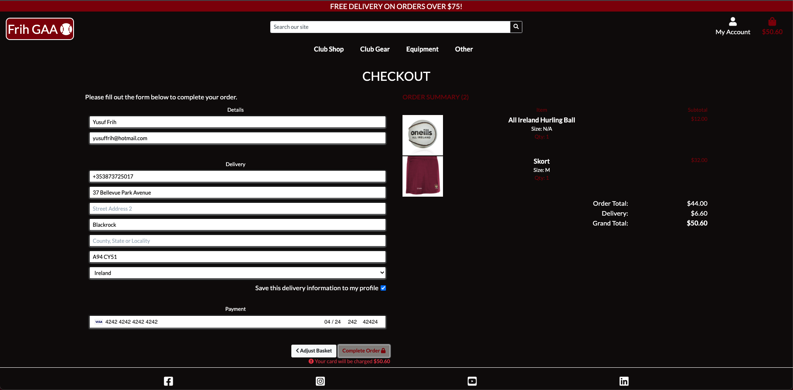

The checkout page consists of two columns. On the left is the form for the user to enter their delivery details and card information and click the submit button to confirm payment. In the column on the right, the user gets a last chance to view their order summary information.  

Also included in the checkout app is the checkout success page which renders once the user has completed their checkout process. The checkout success page displays the order summary in a borderless table and tells the user that they will be contacted by email with details of their order shortly. There is also a button on the bottom of the order summary to allow the user to easily return to the products page. A pop up toast also displays in the top right corner of the page with the order number.

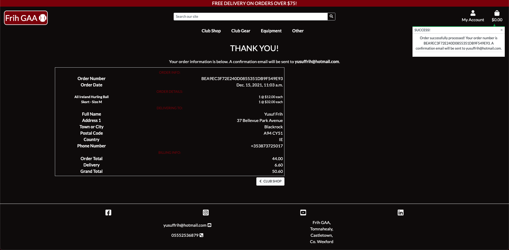

#### Profile
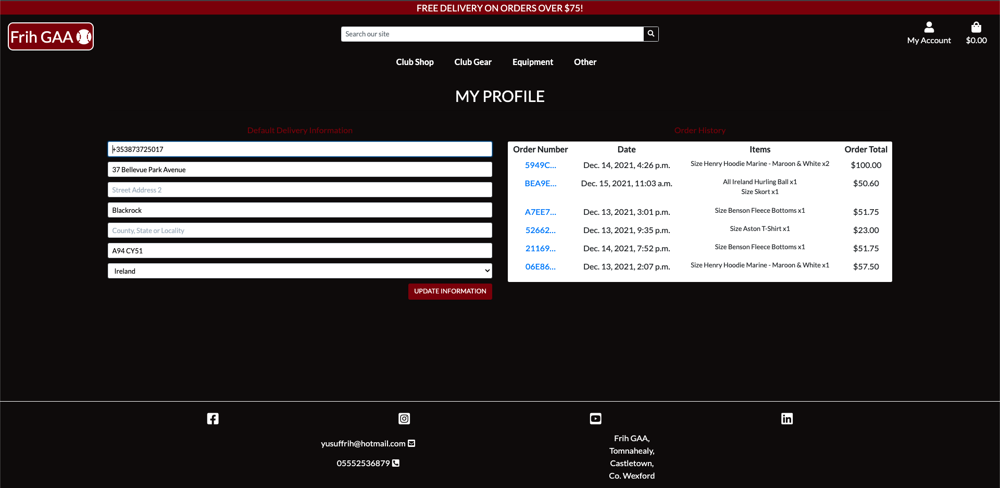
The profile page displays the users profile details if they have opted to have their information saved during an order to allow them to checkout more easily and efficiently for the next time they want to make a purchase. In terms of strucute, the page is made up of two sections, the user details form and the update button on the left side of the screen followed by the orders that the user has placed in the past. 

Each order that the user has made contains a link to the previous order history on via the order number as seen in the blue writing. This link will take the user back to the checkout success page with a message at the top letting the user know that this is a past order. Also on this page is button to take the user back to their profile page.

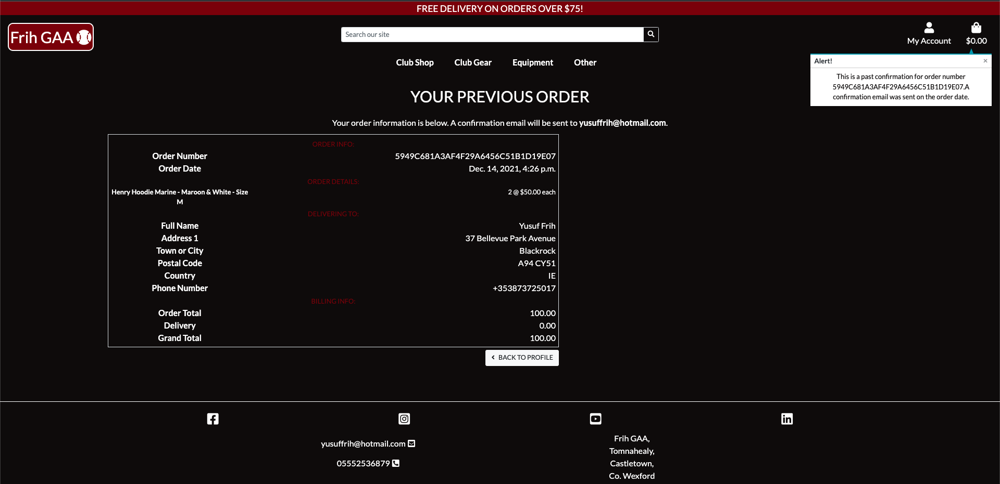

#### Contact

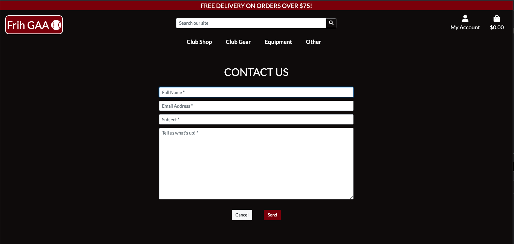
The contact page can be accessed through the link in the navbar. This page is quite simply a form, positioned on the left side of the screen on larger screens and centered on smaller ones. This form allows the user to submit a query to the site owners. They can attached their name and email to this form as well to allow the site owner to respond. 

#### FAQ

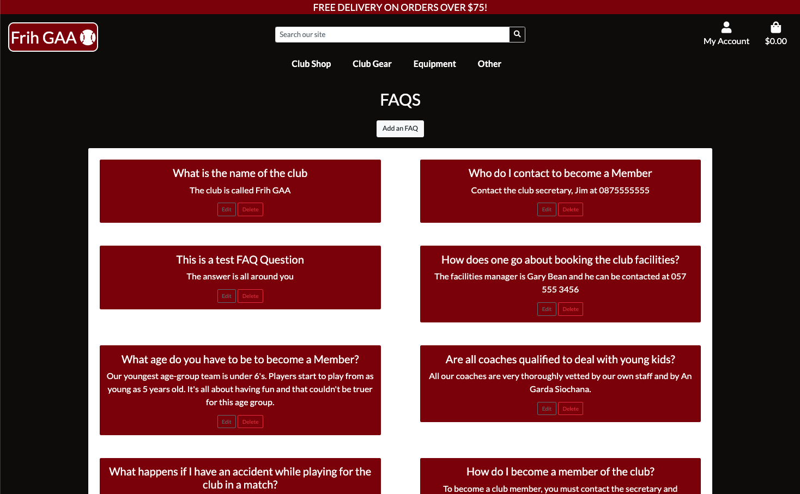

The FAQ page will allow the user to view a list of frequently asked questions about the club. This allows the user to find out some more about the club i.e. who to contact to buy sign up to the club and purchase membership. If the user is a superuser, there are buttons attached to each FAQ to allow the site owner to edit or delete the item. At the top of the page there is an 'Add FAQ' button where the user can of course add an FAQ if they feel the need. The Add and Edit buttons will take the user to similar forms where they can input the relevant information.

### Wireframes
When creating my wireframes, I first drew some rough sketches on paper but then decided that [Balsamiq](https://balsamiq.com/) would be the most suitable technology to use to assist with the design of the site.

You will see from the wireframes that a lot has changed since the planning stage of the project as I learned a lot about what direction I wanted the project to go as I went through the development process.

I created mock ups for my page to fit into the main device types - Desktop, Tablet and Mobile. The mock-ups for the devices can be found here: 
* [Mobile](wireframes/mobile/mobile.png)
* [Tablet](wireframes/tablet/tablet.png)
* [Desktop](wireframes/desktop/desktop.png)

### Data Schema
Django is compatible with SQL databases by default and so I used SQLite in development and then used a PostgresQL database in the deployed site which is provided by [Heroku](https://id.heroku.com/login). 

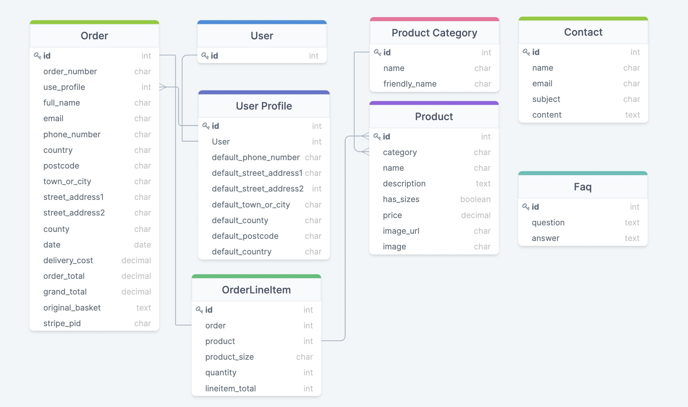

**User model**

Django provides, via django.contrib.auth.models, a ready to use User model which is what is being utilised in this project.

#### Profiles App
**UserProfile model**

| Name | Database Key | Field Type | Type Validation |
| :-------------: |:----------------:| :--------------: | :---------: |
|User | user |	OneToOneField 'User'| on_delete=models.CASCADE
|Default Phone Number |	default_phone_number | CharField | max_length=20, null=True, blank=True
|Default Street Address1 | default_street_address1 | CharField | max_length=80, null=True, blank=True
|Default Street Address2 | default_street_address2 | CharField | max_length=80, null=True, blank=True
|Default Town or City | default_town_or_city | CharField | max_length=40, null=True, blank=True
|Default County | default_county | CharField | max_length=80, null=True, blank=True
|Default Postcode | default_postcode | CharField | max_length=20, null=True, blank=True
|Default Country | default_country | CountryField | blank_label='country', null=True, blank=True

### Products App
**Category model**

| Name | Database Key | Field Type | Type Validation |
| :-------------: |:----------------:| :--------------: | :---------: |
|Name | name | CharField | max_length=254
|Friendly Name | friendly_name | CharField | max_length=254, null=True, blank=True

**Product model**

| Name | Database Key | Validation | Field Type|
| :-------------: |:----------------:| :--------------: | :---------: |
|Product id | id | primary_key=True | AutoField
|Category | category | ForeignKey |default='', max_length=254 | CharField
|Name | name | default='', max_length=254 | CharField
|Description | description | blank=True | TextField
|Has Sizes | has_sizes | BooleanField | default=False, null=True, blank=True
|Price | price | max_digits=6, decimal_places=2 | DecimalField
|Image URL | image_url | blank=False | URLField
|Image| image| blank=False | ImageField

#### Checkout App
**Order model**

| Name              | Database Key    | Field Type    | Type Validation                                                                       |
|-------------------|-----------------|---------------|---------------------------------------------------------------------------------------|
| Order Number      | order_number    | CharField     | max_length=32, null=False, editable=False                                             |
| User Profile      | user_profile    | ForeignKey    | UserProfile, on_delete=models.SET_NULL , null=True, blank=True, related_name='orders' |
| Full Name         | full_name       | CharField     | max_length=50, null=False, blank=False                                                |
| Email             | email           | EmailField    | max_length=254, null=False, blank=False                                               |
| Phone Number      | phone_number    | CharField     | max_length=20, null=False, blank=False                                                |
| Country           | country         | CountryField  | blank_label='Country'*, null=False, blank=False                                       |
| Postcode          | postcode        | CharField     | max_length=20, null=True, blank=True                                                  |
| Town or City      | town_or_city    | CharField     | max_length=40, null=False, blank=False                                                |
| Street Address 1  | street_address1 | CharField     | max_length=80, null=False, blank=False                                                |
| Street Address 2  | street_address2 | CharField     | max_length=80, null=False, blank=False                                                |
| County            | county          | CharField     | max_length=80, null=False, blank=False                                                |
| Date              | date            | DateTimeField | auto_now_add=True                                                                     |
| Delivery Cost     | delivery_cost   | DecimalField  | max_digits=6, decimal_places=2, null=False, default=0                                 |
| Order Total       | order_total     | DecimalField  | max_digits=10, decimal_places=2, null=False, default=0                                |
| Grand Total       | grand_total     | Decimal Field | max_digits=10, decimal_places=2, null=False, default=0                                |
| Original Basket   | original_basket | TextField     | null=False, blank=False, default=''                                                   |
| Stripe Payment ID | stripe_pid      | CharField     | max_length=254, null=False, blank=False, default=''                                   |

**Order Line Item model**

| Name            | Database Key   | Field Type   | Type Validation                                                                    |
|-----------------|----------------|--------------|------------------------------------------------------------------------------------|
| Order           | order          | ForeignKey   | Order, null=False, blank=False, on_delete=models.CASCADE, related_name='lineitems' |
| Product         | product        | ForeignKey   | Product, null=False, blank=False, on_delete=models.CASCADE                         |
| Product Size    | product_size   | CharField    | max_length=2, null=True, blank=True                                                |
| Quantity        | quantity       | IntegerField | null=False, blank=False, default=0                                                 |
| Line Item Total | lineitem_total | DecimalField | max_length=6, decimal_places=2, null=False, blank=False, editable=False            |


**FAQ Model**
| Name     | Database Key | Field Type | Type Validation                              |
|----------|--------------|------------|----------------------------------------------|
|FAQ id | id | primary_key=True | AutoField
| Question | question     | TextField  | max_length= 300 , null= False , blank= False |
| Answer   | answer       | TextField  | max_length= 900 , null= False , blank= False |

**Contact Model**
| Name    | Database Key | Field Type | Type Validation                          |
|---------|--------------|------------|------------------------------------------|
|Contact id | id | primary_key=True | AutoField
| Name    | name         | CharField  | max_length=50, null=False, blank=False   |
| Email   | email        | EmailField | max_length=50, null=False, blank=False   |
| Subject | subject      | CharField  | max_length=254, null=False, blank=False  |
| Content | content      | TextField  | max_length=3000, null=False, blank=False |

## Features

### Features Implemented
* User Authentication using Allauth. This allows login, logout, email verifation and other features.
* The club shop, givin the users the ability to browse and purchase club merchandise
* Product categorisation giving the users the ability to quickly search for certain types of products they are looking for 
* For each product, there is a product details page which outlines the details of that particular product or membership
* Search bar functionality, giving the users the ability to search the site for products by name or category
* 'Sort by' feature giving the users the ability to sort the products list by price, size, category, and other criteria
* Online payments feature made available via Stripe
* A contact form for site users to contact the club administrator and provide feedback, suggest improvements or just ake queries
* FAQ page giving the user the ability to quickly look for commonly asked questions about the club


### Features Yet To Implement
* Club news page where members can keep up to date with the different club activities such as fundraisers
* Club gym booking form to be able to book a slot that you can use the gym facility
* Matches site where the user can keep up to date with what matches the club is involved in
* Memberships section on the site to allow people to purchase their memberships for the year
* Gallery of pictures of the club's facilities to entice non-member site users to join the club

*I did not have time to implement all the features I would have liked.*

## Technologies Used

### Languages
* HTML
* CSS
* Javacript
* Python

### Frameworks & Libraries
* Bootstrap
* Google Fonts
* Font Awesome
* JQuery
* Stripe

### Tools
* Heroku
* Django
* Gitpod
* Git
* Balsamic
* DrawSQL
* W3 HTML Validation
* W3 CSS Validation
* AWS
* SQLite3
* Auto Prefixer

## Testing & Bugs
Testing carried out on the site can be found [here](TESTING.md) in a separate file

## Deployment

Note: When deploying my project initially, I pushed my database url to Github. Luckily, I had no data in my database and it was easy for me to delete my postgres database and create a new one. This nuetralised any threat that there may have been to the app. Also, committed and pushed SQLite3 Database & SECRET_KEY to the [Github](https://github.com) repository, however, I deleted a the SQLite3 Database, created a new one and added it to the .gitignore file. I also generated a new SECRET_KEY and stored it as an environment variable in [Gitpod](https://gitpod.io).


### Deploying Locally

[Gitpod](https://gitpod.io/) was used for the development of this project and so the following deployments step-by-step process is specific to [Gitpod](https://gitpod.io/) and may vary with other [IDEs](https://en.wikipedia.org/wiki/Integrated_development_environment). 

#### Cloning
1. Once you are at the project repository in [Github](https://github.com/), you click on the code button and then download the repository zip file. Another way to do it is to use the following code in the terminal:
``` 
git clone https://github.com/Yusuffrih/CI_MS4_FrihGAA.git
```
2. Once this is done, you then install the project requirements using the command: 
```
pip3 install -r requirements.txt
```
3. Create any sensitive or private environment variables in you IDE settings. This will ensure that they are not in the code that is being pushed to the public repository. 

4. Then you have to migrate the models to create the database using the following command.
```
python3 manage.py migrate
```
5. The next step then is to a create superuser and password for the app. This is done using the following command in the terminal.
```
python3 manage.py createsuper
```
Once the command is entered, you will be prompted to input the username, email address for the user account and then password. You will be required to input the password twice. The input details will not appear on screen, but they are being registered.
6. At this stage, the app is up and running and you can run it using the below command in the terminal: (note - to access the admin section of the app, add */admin* to the end of the URL)
```
python3 manage.py runserver
```

### Heroku
1. Create a [Heroku](https://id.heroku.com/) or login to create a new app. Once you have chosen a Heroku app name, you must then choose the region that is closest to you. Ensure your app is connected to the relevant [Github](https://github.com/) repository to allow for automatic deployment to [Heroku](https://heroku.com/).
2. The default database that is installed with [Django](https://www.djangoproject.com/) is [SQLite3](https://www.sqlite.org/releaselog/3_36_0.html). However, when you deploy to [Heroku](https://id.heroku.com/) and go to production mode, you will want to change to another database such as [Postgres](https://www.postgresql.org/). To add this to your project, go to resources and search *Postgres*. Click on it and submit the order form.

3. This will provide you with a database url for your project. To access it, go to settings in [Heroku](https://id.heroku.com/) and reveal the *Config Vars*.


4. Copy and paste the Environment Variavle into your settings.py file instead of the database that is there already. 
```
DATABASES = {
        'default': dj_database_url.parse('Postgres URL here')
    }
```
**NOTE** do not push this Database URL to your [Github](https://github.com/) repository.

5. Once this is in place, then run your migrations:
```
python3 manage.py migrate
```

6. Once migrations are complete, you will have to create a superuser in the new database. To do this use the following command:
```
python3 manage.py createsuperuser
```
Once the command is entered, you will be prompted to input the username, email address for the user account and then password. You will be required to input the password twice. The input details will not appear on screen, but they are being registered.

7. Run the app and visit the admin page at https://yourlivesiteurl.herokuapp.com/admin/ and add the email address. Then ensure that verified and primary checkboxes are clicked.

8. You will need to load your data to the [Postgres](https://www.postgresql.org/) database using the following command:
```
python3 manage.py loaddata <your-fixtures-filename>
```
ensure to repeat this for all your fixtures and to load categories before loading the main model for the app.

9. Once the migrations are complete and the data is loaded into the database, change the database configuration to a conditional one whereby it uses the [SQLite3](https://www.sqlite.org/releaselog/3_36_0.html) database for development purposes and the [Postgres](https://www.postgresql.org/) one in production. Do this by creating a new environment variable in the Gitpod variables section.
```
if 'DATABASE_URL' in os.environ:
        DATABASES = {
            'default': dj_database_url.parse(os.environ.get('DATABASE_URL'))
        }
    else:
        DATABASES = {
            'default': {
                'ENGINE': 'django.db.backends.sqlite3',
                'NAME': os.path.join(BASE_DIR, 'db.sqlite3'),
            }
        }
```

10. You will need to set up a Procfile using the following command:
```
echo web: python app.py > Procfile
```
The Procfile just needs to have one line of code in it: 
```
web: gunicorn <your-app-name>.wsgi:application
```

11. Ensure that you have the requirements.txt file up to date using the following command:
```
pip freeze --local > requirements.txt
```

12. Ensure to add your Heroku URL to the `ALLOWED_HOSTS` settings.py file to ensure that the site works. Also ensure that you add `'localhost'` to allow for development

13. Add, commite and push all your changes to [Github](https//:github.com/).

14. Return to the deploy section in the [Heroku](https://heroku.com/) app and enable automatic deployment. 

15. Click the deploy button. The app should start building now. As you have linked the [Heroku](https://heroku.com/) app to your [Github](https//:github.com/) repository, all you need to do to deploy to Heroku is push to [Github](https//:github.com/) and this will automatically push to [Heroku](https://heroku.com/).

For production, it's best to store the static files in [AWS - S3](https://s3.console.aws.amazon.com/s3) - Amazon Web Service and the documentation for this can be found on the official [AWS webiste](https://eu-west-1.console.aws.amazon.com/) or you can follow a Youtube tutorial on how to do this [here](https://www.youtube.com/watch?v=e6w9LwZJFIA).


## Disclaimer 

This project is purely for educational purposes and is not inteded for any profit or commercial reason at all. All third party material used on this site has been referenced below in the credits section.

## Credits

### Images and Content 

* All of the product images as well as the product descriptions on the site came from [O'Neills GAA Store](https://www.oneills.com/)

* The club logo on the homepage came from the [Google Images](https://www.google.com/imghp?hl=en) when I searched for my home club's gaa logo on which the site is based. 

* The about paragraph on the homepage has been lifted from [Club Info](https://www.clubinfo.ie/club/castletown-liam-mellows-gfc/) and the name Castletown GAA has been changed to Frih GAA for the purposes of this site.

### Code

* For a large portion of this project, used the Boutique Ado walkthrough project to guide me through this and borrowed a large amount of code to assist with the structuring of the project and the functionality also.

* [Django Documentation]() was used to assist specifically with the Allauth setup and also with other aspects of setting up this Django project.

* For the contact app I followed this helpful [Twilio](https://www.twilio.com/blog/build-contact-form-python-django-twilio-sendgrid) tutorial but used by own smtp email service via [Gmail](https://google.com/gmail).

* I followed the [W3 Schools](https://www.w3schools.com/howto/tryit.asp?filename=tryhow_js_scroll_to_top) 

* I used [Bootstrap](https://getbootstrap.com/docs/4.6/getting-started/introduction/) throughout the devlopment of the project to provide the  navbar, footer, buttons, toasts, cards, images and links.

* Any time I had a bug, I went to [Stack Overflow](https://stackoverflow.com/) to try and find out what the solution is for the issue. This is a very helpful community.

* [Code Institute](https://codeinstitute.net/ie/) tutors.


## Final Comments

As a final note on this project and on the overall course with Code Institute, I would just like to thank a few people:

1. My mentor Simen Daehlin for the fantastic guidance and advice throughout this challenging time.
2. The tutors with Code Institute as they do their absolute best to help everyone that comes to them. They are a fantastic group of people who have the patients of a saint.
3. Everyone in the Slack Community for always being there to help each other out in times of need. You're all amazing! 
4. My family and partner for being so patient with me over the past 11 months of the course. Thank you so much for everything!